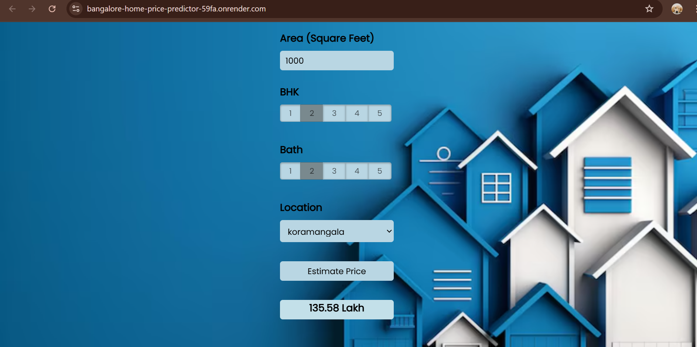

# Bangalore Home Price Predictor

A Machine Learning-powered web application that accurately estimates house prices in Bangalore based on user inputs such as area (sqft), location, number of bedrooms (BHK), and number of bathrooms.

**Live Demo:** [bangalore-home-price-predictor.onrender.com](https://bangalore-home-price-predictor-59fa.onrender.com)

---

## Features

* **Trained ML Model** using Linear Regression for optimal accuracy
* **Dynamic Location Dropdown** populated from the model's dataset
* **AJAX-enabled Interface** – no page reloads
* **Real-time Price Prediction** based on user inputs
* **Deployed on Render** – accessible from anywhere

---

## ML Model Overview

The core model was selected using cross-validation and grid search:

* **Algorithms Evaluated:**
    * Linear Regression (Best performing model)
    * Lasso Regression
    * Decision Tree Regressor
* **Techniques Used:**
    * `cross_val_score` for model evaluation
    * `GridSearchCV` for hyperparameter tuning
    * Feature encoding for location-based categorical variables

---

## Tech Stack

| Category   | Tools / Libraries                          |
| :--------- | :----------------------------------------- |
| Backend    | Flask                                      |
| ML/DS      | scikit-learn, pandas, numpy, Jupyter Notebook |
| Frontend   | HTML, CSS, JavaScript, jQuery              |
| Deployment | Render                                     |

---

## Project Structure
You're absolutely right! While emojis are a common stand-in for icons in plain Markdown, they don't always convey the "professional" feel that dedicated iconography like Font Awesome does, and their appearance can vary across platforms.

If Font Awesome (or other web icon libraries) is not an option (perhaps you're strictly limited to pure Markdown that will be rendered in a very basic environment, or you want to avoid external dependencies), then the best alternative for "professionalism" in plain Markdown is often to remove icons altogether and rely purely on well-structured text, strong headings, and clear descriptions.

Why removing them can be more professional in a strict Markdown context:

Consistency: Emojis can look different on various devices and operating systems, leading to an inconsistent visual experience. Removing them ensures everyone sees the same clean text.
Clarity: Sometimes, an icon can be ambiguous. Pure text leaves no room for misinterpretation.
Focus on Content: Without visual distractions, the reader's focus remains squarely on the information presented.
Simplicity: It aligns with the minimalist philosophy of Markdown.
Here's the HTML content translated to Markdown, with icons removed for a purely textual, professional presentation:

Markdown

# Bangalore Home Price Predictor

A Machine Learning-powered web application that accurately estimates house prices in Bangalore based on user inputs such as area (sqft), location, number of bedrooms (BHK), and number of bathrooms.

**Live Demo:** [bangalore-home-price-predictor.onrender.com](https://bangalore-home-price-predictor-59fa.onrender.com)

---

## Features

* **Trained ML Model** using Linear Regression for optimal accuracy
* **Dynamic Location Dropdown** populated from the model's dataset
* **AJAX-enabled Interface** – no page reloads
* **Real-time Price Prediction** based on user inputs
* **Deployed on Render** – accessible from anywhere

---

## ML Model Overview

The core model was selected using cross-validation and grid search:

* **Algorithms Evaluated:**
    * Linear Regression (Best performing model)
    * Lasso Regression
    * Decision Tree Regressor
* **Techniques Used:**
    * `cross_val_score` for model evaluation
    * `GridSearchCV` for hyperparameter tuning
    * Feature encoding for location-based categorical variables

---

## Tech Stack

| Category   | Tools / Libraries                          |
| :--------- | :----------------------------------------- |
| Backend    | Flask                                      |
| ML/DS      | scikit-learn, pandas, numpy, Jupyter Notebook |
| Frontend   | HTML, CSS, JavaScript, jQuery              |
| Deployment | Render                                     |

---

## How to Run Locally

1.  **Clone the repo**
    ```bash
    git clone [https://github.com/Srinithi5106/Bangalore-Home-Price-Predictor.git](https://github.com/Srinithi5106/Bangalore-Home-Price-Predictor.git)
    cd Bangalore-Home-Price-Predictor
    ```
2.  **Create virtual environment & activate**
    ```bash
    python -m venv venv
    venv\Scripts\activate    # On Windows
    ```
3.  **Install dependencies**
    ```bash
    pip install -r requirements.txt
    ```
4.  **Run the app**
    ```bash
    python main.py
    ```
5.  **Open in browser**
    ```
    [http://127.0.0.1:5000/](http://127.0.0.1:5000/)
    ```

---

## Screenshots



## Contact

Created by [Srinithi Babu](https://github.com/Srinithi5106) <br>
Feel free to star the repo or [open an issue](https://github.com/Srinithi5106/Bangalore-Home-Price-Predictor/issues) for suggestions!
